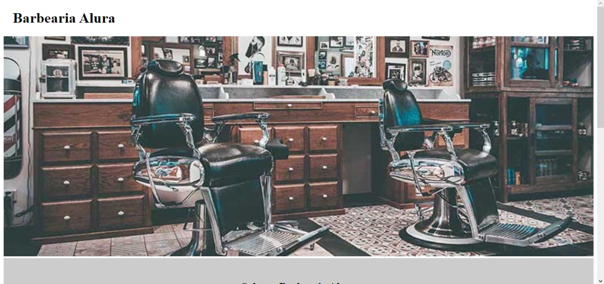

<h1 align="center"> Barbearia </h1>

Site desenvolvido pelo frameworks HTML5 E CSS3 pelo curso da Alura, para ensino de tecnologias WEB

  <a href="#-tecnologias">Tecnologias</a>&nbsp;&nbsp;&nbsp;|&nbsp;&nbsp;&nbsp;
  <a href="#-projeto">Projeto</a>&nbsp;&nbsp;&nbsp;

 

  

  

## 🚀 Tecnologias

Esse projeto foi desenvolvido com as seguintes tecnologias:

- HTML e CSS
- Git e Github

## 💻 Projeto

Criação de site visual para barbearias!!!

Feito com ♥ by Alura & Samuel Oliveira.
